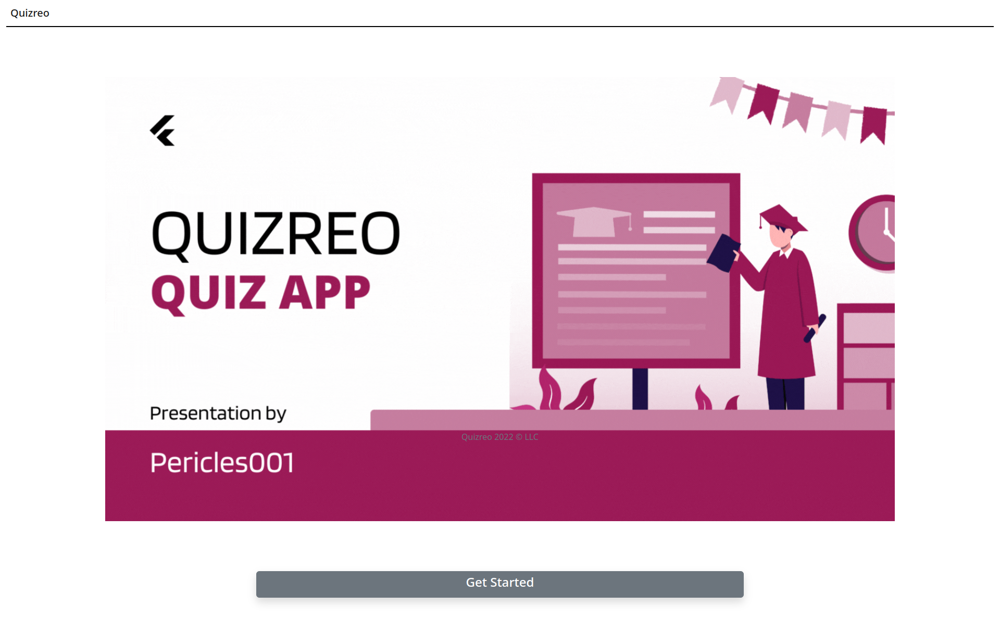
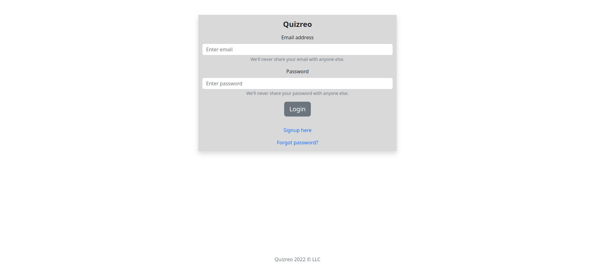
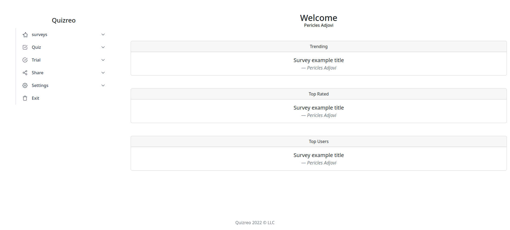
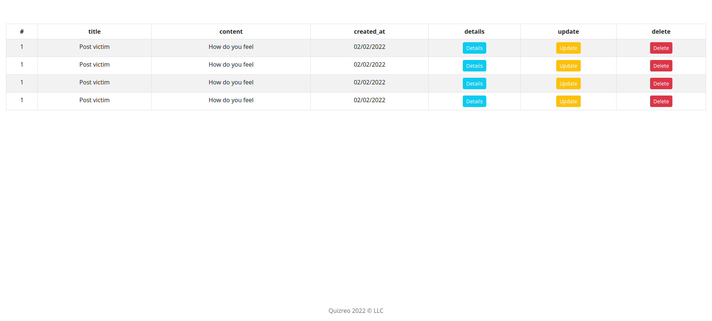
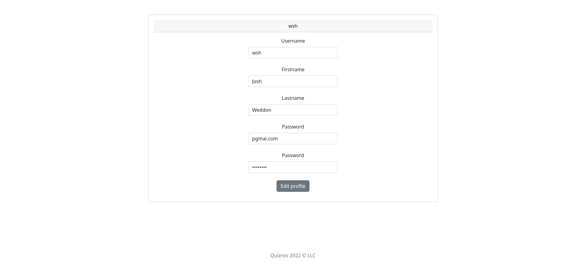
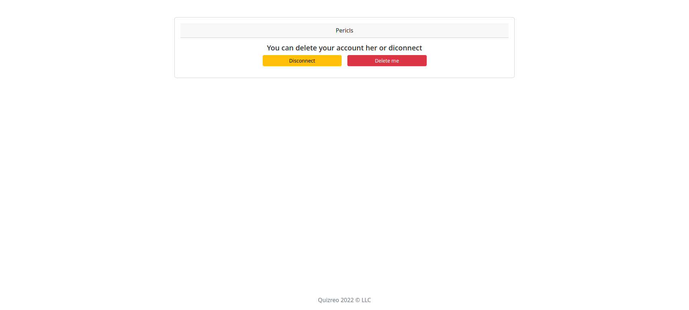

# Quizreo_frontend

Official Frontend application for Quizreo project

## Description

Quizreo is a web application that allows users to create and take quizzes. It is a project aiming to help open source community.

## Technologies
-   [reactjs](https://reactjs.org/t)
-   [react-socks](https://www.npmjs.com/package/react-socks)
-   [react-router-dom](https://v5.reactrouter.com/)
-   [firebase](https://firebase.google.com/)

## Demo

Screenshots of the UI are visible below : 

### Homepage

### Login page

### signup page

### dashboard

### list new resource

### Manage profile

### Manage account

## Usage

You can view live demo on the  following URL : __coming soon__

Or you can try locally:

* clone the repository

        git clone https://github.com/Pericles001/Quizreo_frontend.git

* install dependencies

        npm install (or yarn install)

* launch live server

        npm run start (or yarn start)

## Contributing

* You can contribute in various ways:

* Declare bugs or suggest updates via issues

* Improve codebase

## Authors

[Pericles001](https://github.com/Pericles001)
